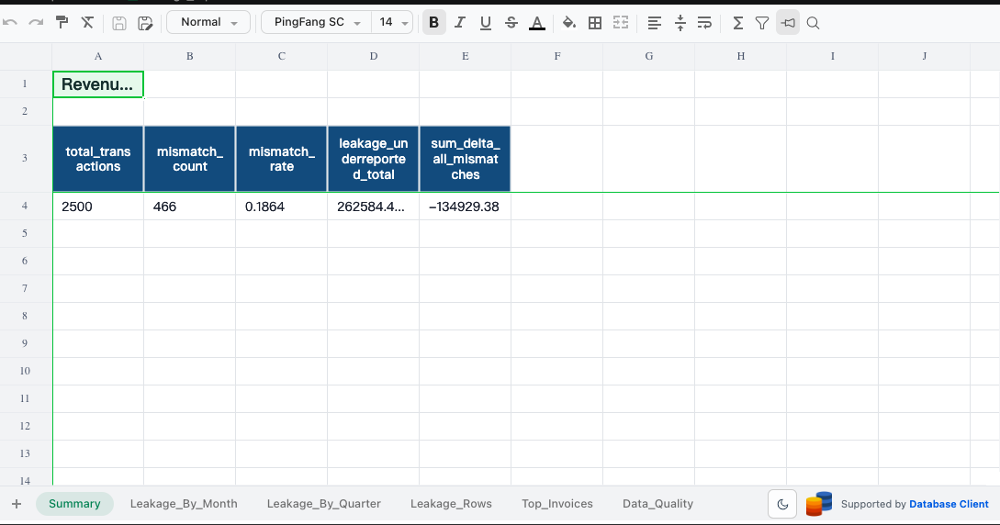
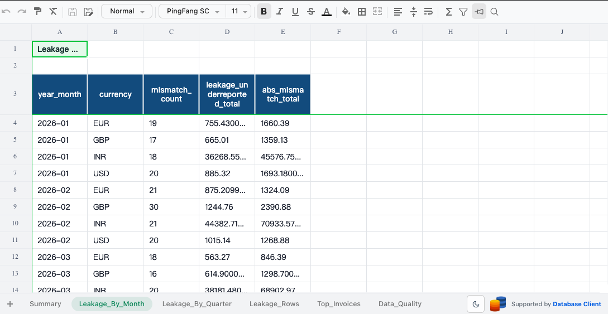
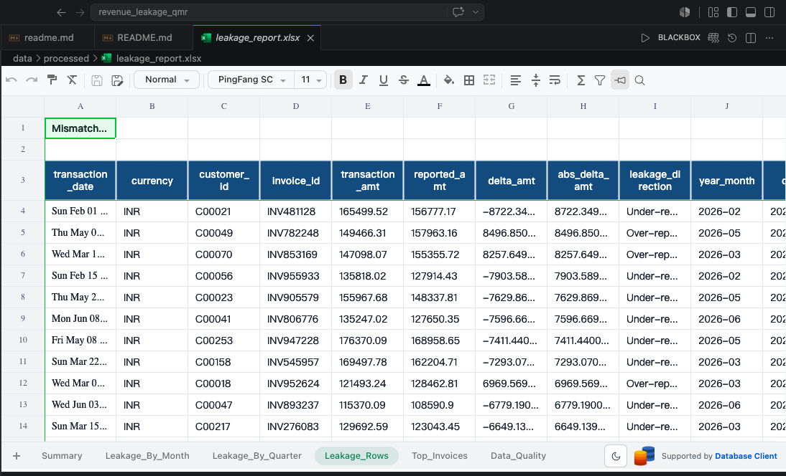
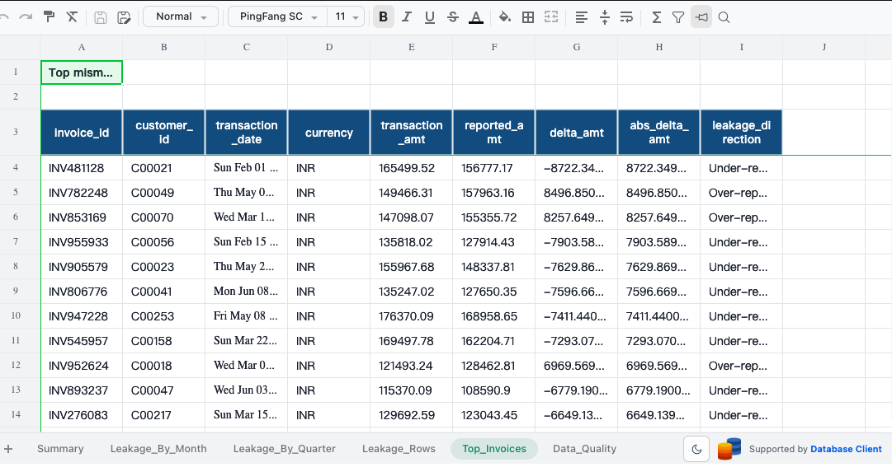
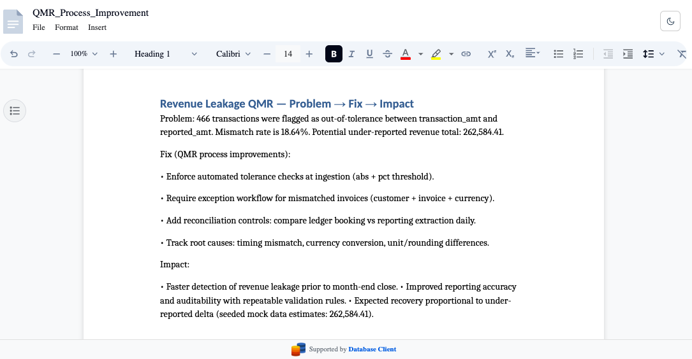

# revenue_leakage_qmr

End-to-end Python automation for Revenue Leakage QMRs: validates transaction data, flags >1% mismatches, and auto-generates Excel reports + 1-page Word summaries. Built for Product Data Analyst workflows. Tech: Pandas, openpyxl, python-docx

## Screenshots (generated artifacts)

**Excel Summary (KPI)**



**Excel Leakage by Month**



**Excel Leakage Rows (flagged records)**



**Excel Top Invoices**



**Word 1-pager**



## Project structure & responsibilities

### Entry point

- `main.py` — runs the end-to-end pipeline:
  - load/validate transactions (`src/data_loader.py`)
  - flag leakage and aggregate tables (`src/leakage_analysis.py`)
  - write Excel (`src/excel_writer.py`)
  - generate a Word 1‑pager (inline in `main.py`)

### Core modules

- `src/config.py` — tolerances, required CSV column names, and output/input paths.
- `src/data_loader.py` — reads `data/raw/transactions.csv` (or generates mock data if missing) + validates and normalizes.
- `src/leakage_analysis.py` — computes `delta_amt`, marks `is_mismatch` using tolerance thresholds, labels direction, and builds aggregate tables.
- `src/excel_writer.py` — creates `data/processed/leakage_report.xlsx` with formatted sheets.

## How to use

1) Install dependencies:

```bash
pip install -r requirements.txt
```

2) Run:

```bash
python main.py
```

## Outputs

- Excel: `data/processed/leakage_report.xlsx`
- Word 1‑pager: `reports/QMR_Process_Improvement.docx`
